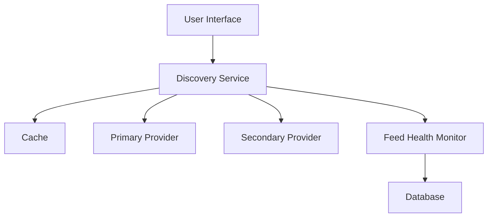
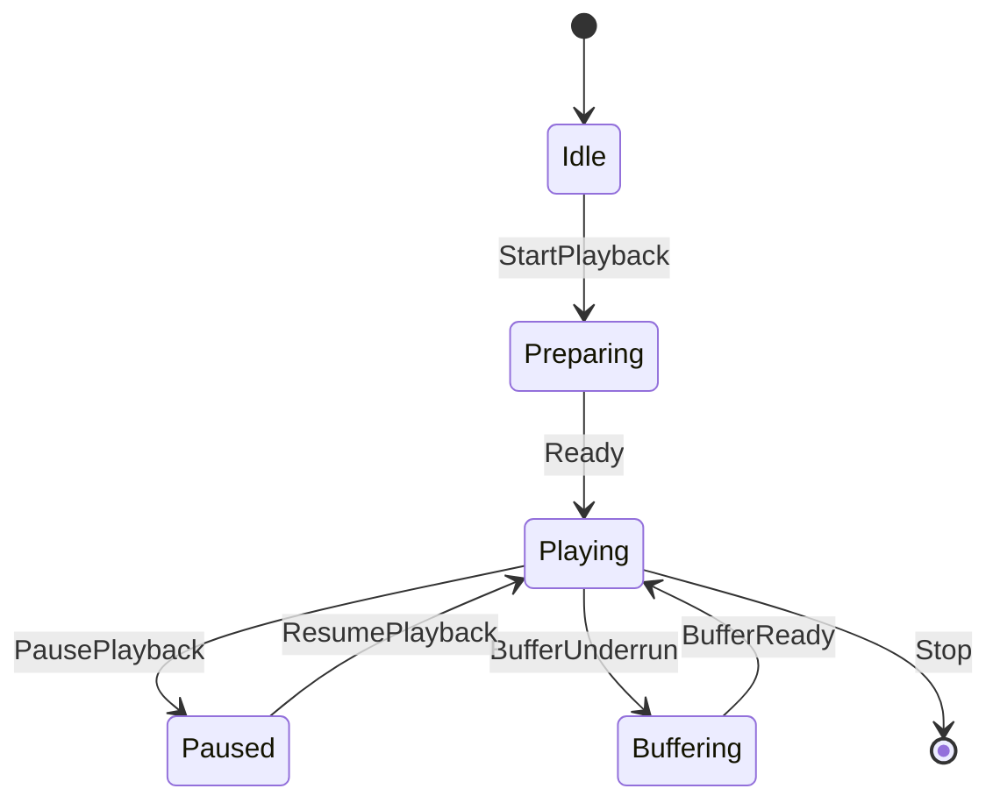
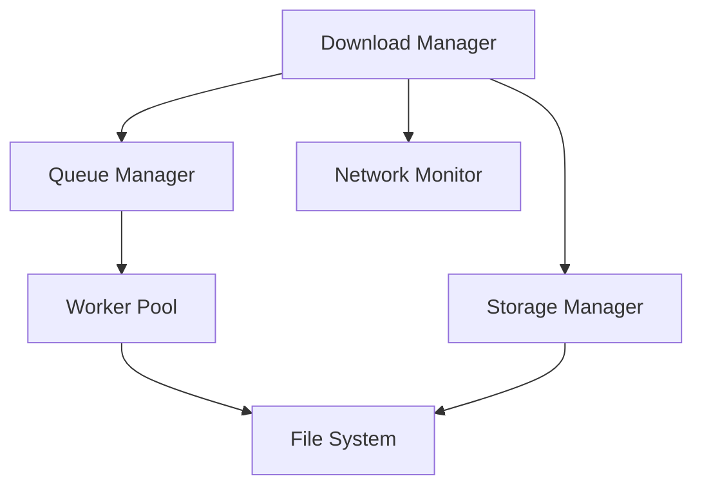
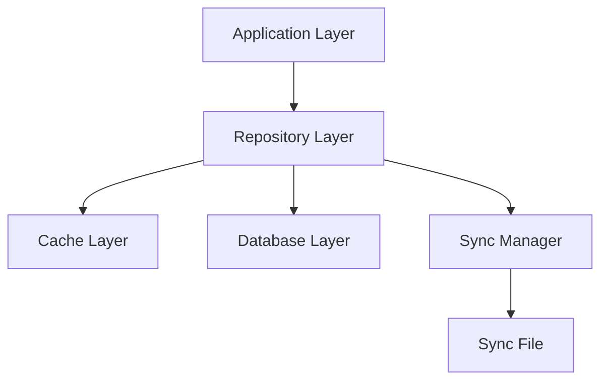
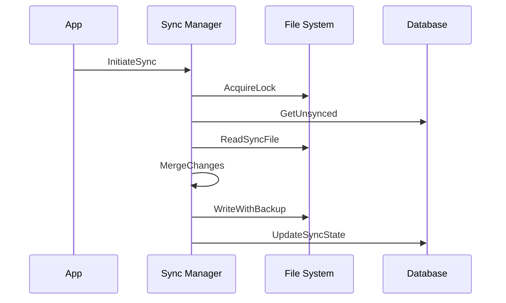

# PodcastApp9000: Detailed Design

## 1. Core Components

### 1.1 Podcast Discovery Service

#### Design Pattern
- Implements Provider Pattern with fallback chain
- Uses Observer Pattern for feed health monitoring
- Incorporates Cache-Aside Pattern for search results

#### Key Responsibilities
- Podcast search and metadata retrieval
- Feed validation and health monitoring
- Results caching and rate limiting
- Source provider management

#### Component Interactions

### 1.2 Audio Playback Engine

#### Design Pattern
- Bridge Pattern for platform-specific implementations
- State Pattern for playback state management
- Observer Pattern for state changes

#### Platform-Specific Considerations

##### Android
- Audio Focus Management
- MediaSession integration
- Foreground service requirements
- Battery optimization handling
- Wake lock management

##### Windows
- AudioGraph system
- SystemMediaTransportControls
- Background process management
- Device change handling

#### Component State Machine

### 1.3 Download Manager

#### Design Pattern
- Command Pattern for download queue
- Strategy Pattern for storage management
- Observer Pattern for progress monitoring

#### Key Responsibilities
- Download queue management
- Network type handling
- Storage space management
- File integrity verification
- Resume capability

#### Component Interactions

## 2. Data Management

### 2.1 Database Architecture

#### Design Pattern
- Repository Pattern
- Unit of Work Pattern for transactions
- Observer Pattern for change tracking

#### Concurrency Strategy
- Optimistic concurrency for read operations
- Pessimistic locking for critical writes
- Transaction isolation for batch operations

#### Data Flow

### 2.2 Sync System

#### Design Pattern
- Event Sourcing for change tracking
- CQRS for sync operations
- Saga Pattern for sync process

#### Sync Process Flow

## 3. Error Handling

### 3.1 Error Hierarchy
- System Errors
  - Network Errors
  - Storage Errors
  - Platform Errors
- Application Errors
  - Playback Errors
  - Download Errors
  - Sync Errors
- User Errors
  - Input Validation
  - Permission Issues

### 3.2 Recovery Strategies
- Automatic retry for transient failures
- Graceful degradation for feature failures
- State recovery for app crashes
- Conflict resolution for sync issues

## 4. Background Operations

### 4.1 Task Categories
- Critical Tasks (Playback)
- Important Tasks (Downloads)
- Maintenance Tasks (Cleanup)
- Optional Tasks (Updates)

### 4.2 Resource Management
- Battery impact considerations
- Network bandwidth management
- Storage space management
- Memory usage optimization

## 5. Cross-Component Communication

### 5.1 Event System
- Centralized event bus
- Typed event messages
- Observable streams
- Event prioritization

### 5.2 State Management
- Immutable state objects
- State change notifications
- State persistence strategy
- Recovery mechanism

## 6. Platform Integration

### 6.1 Android Integration
- Service lifecycle management
- Platform notifications
- Battery optimization
- Media session handling

### 6.2 Windows Integration
- App lifecycle management
- System media controls
- Power management
- Audio routing

## 7. Security Considerations

### 7.1 Data Protection
- Feed validation
- Download verification
- Sync file integrity
- Local data security

### 7.2 Resource Access
- Storage permissions
- Network access
- System integration
- Background execution